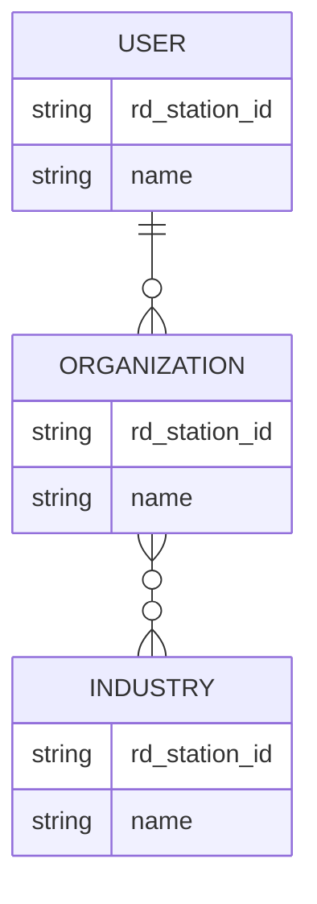
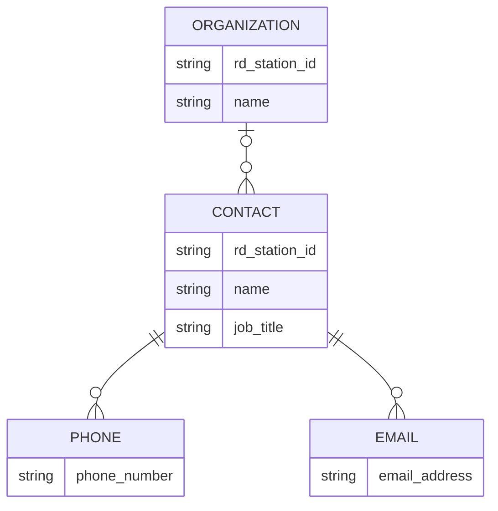
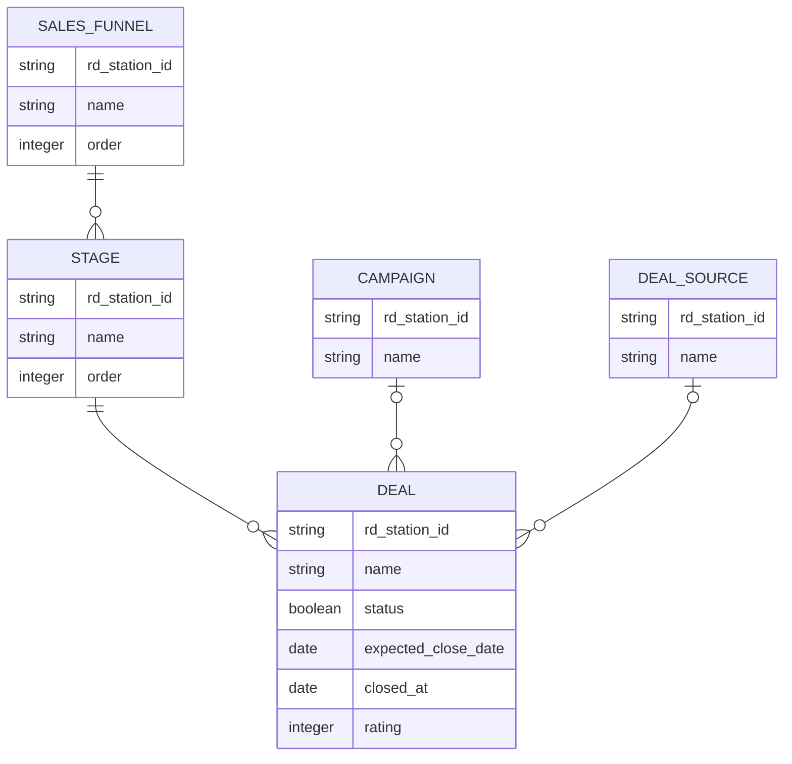
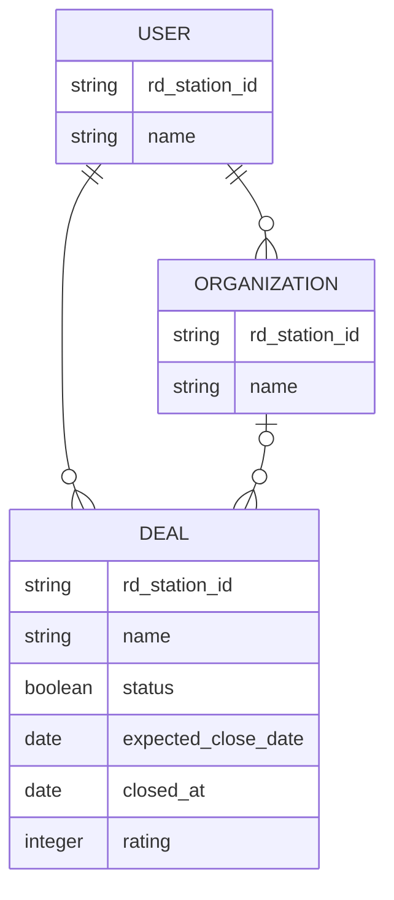
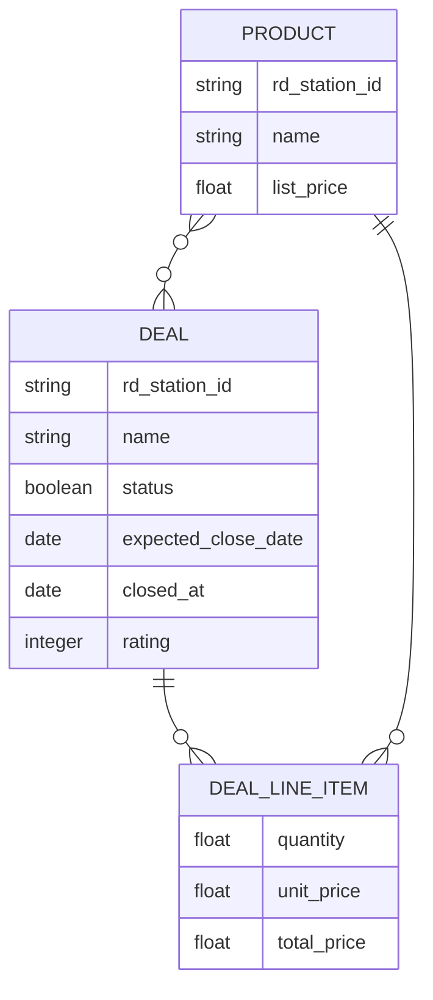

# db-migrations
## Sales schema
### Organization context

```mermaid
erDiagram
    USER {
        string rd_station_id
        string name
    }

    ORGANIZATION {
        string rd_station_id
        string name
    }

    USER ||--o{ ORGANIZATION : ""

    INDUSTRY {
        string rd_station_id
        string name
    }

    ORGANIZATION }o--o{ INDUSTRY : ""
```
### Contact context

```mermaid
erDiagram
    ORGANIZATION {
        string rd_station_id
        string name
    }

    CONTACT {
        string rd_station_id
        string name
        string job_title
    }

    ORGANIZATION |o--o{ CONTACT : ""

    PHONE {
        string phone_number
    }

    CONTACT ||--o{ PHONE : ""

    EMAIL {
        string email_address
    }

    CONTACT ||--o{ EMAIL : ""
```
### Sales funnel context

```mermaid
erDiagram
    SALES_FUNNEL {
        string rd_station_id
        string name
        integer order
    }

    STAGE {
        string rd_station_id
        string name
        integer order
    }

    SALES_FUNNEL ||--o{ STAGE : ""

    CAMPAIGN {
        string rd_station_id
        string name
    }

    DEAL_SOURCE {
        string rd_station_id
        string name
    }

    DEAL {
        string rd_station_id
        string name
        boolean status
        date expected_close_date
        date closed_at
        integer rating
    }

    STAGE ||--o{ DEAL : ""
    CAMPAIGN |o--o{ DEAL : ""
    DEAL_SOURCE |o--o{ DEAL : ""
```
### User context

```mermaid
erDiagram
    USER {
        string rd_station_id
        string name
    }    

    DEAL {
        string rd_station_id
        string name
        boolean status
        date expected_close_date
        date closed_at
        integer rating
    }

    USER ||--o{ DEAL : ""

    ORGANIZATION {
        string rd_station_id
        string name
    }   

    ORGANIZATION |o--o{ DEAL : ""
    USER ||--o{ ORGANIZATION : ""
```

### Product context

```mermaid
erDiagram
    DEAL {
        string rd_station_id
        string name
        boolean status
        date expected_close_date
        date closed_at
        integer rating
    }

    PRODUCT {
        string rd_station_id
        string name
        float list_price
    }

    PRODUCT }o--o{ DEAL : ""

    DEAL_LINE_ITEM {
        float quantity
        float unit_price
        float total_price
    }

    DEAL ||--o{ DEAL_LINE_ITEM : ""
    PRODUCT ||--o{ DEAL_LINE_ITEM : ""
```
